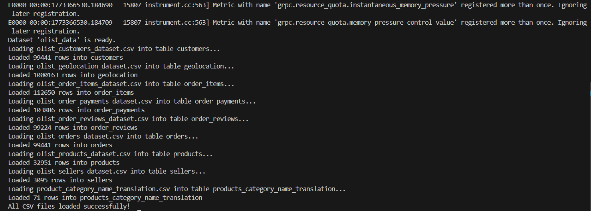

# Key Achievements

* Built an end-to-end data pipeline

* Implemented SCD Type 2 snapshots

* Designed a star schema for analytics

* Ensured data quality with Great Expectations

* Successfully executed dbt workflows

* Performed data analysis on cleaned datasets

## Conclusion

This project showcases how to:

Ingest and transform raw data into a structured warehouse

Maintain historical data using snapshots

Build scalable analytics-ready models

Ensure data quality and reliability

# Screen shots of output

