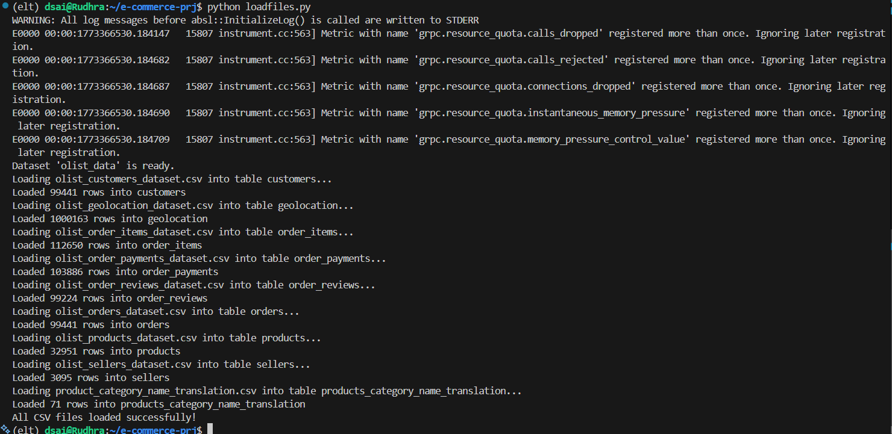
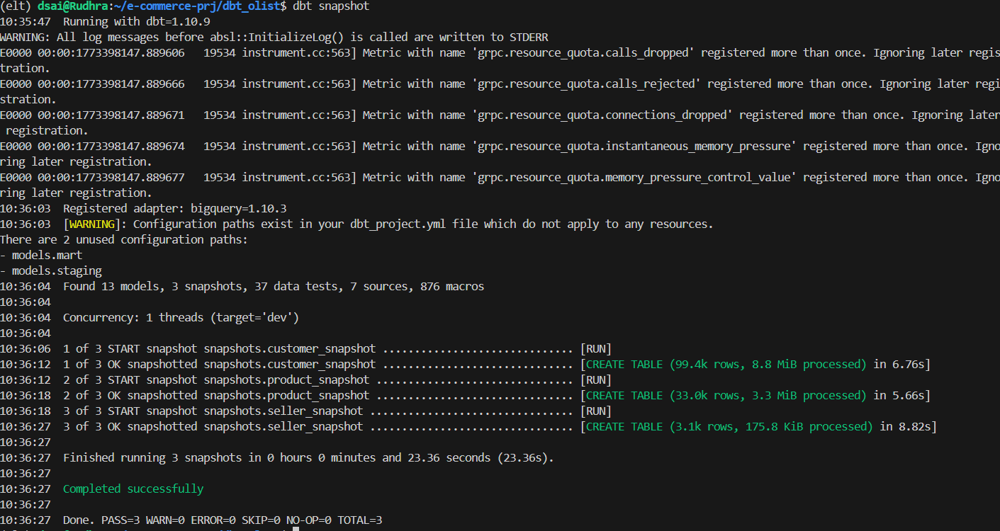

# Olist dbt Project

This dbt project builds a data mart for the Olist dataset, including staging, dimension, fact tables, and snapshots in BigQuery. It follows dbt best practices, is cost-efficient, and organized for clear dependency management.

---

## Project Structure

```
models/
├── staging/
│   ├── stg_customers.sql
│   ├── stg_orders.sql
│   ├── stg_order_items.sql
│   ├── stg_payments.sql
│   ├── stg_reviews.sql
│   ├── stg_products.sql
│   ├── stg_sellers.sql
│   └── stg_product_category_name_translation.sql
└── mart/
    ├── dim_customers.sql
    ├── dim_products.sql
    ├── dim_sellers.sql
    ├── dim_date.sql
    ├── dim_category.sql
    ├── fact_orders.sql
    ├── fact_payments.sql
    └── fact_reviews.sql
snapshots/
    ├── customer_snapshot.sql
    ├── product_snapshot.sql
    └── seller_snapshot.sql
```

---

## Materialization Strategy

* **Staging tables (`stg_*`)**: materialized as **views** to reduce storage costs and scan small raw tables.
* **Dimension and fact tables (`dim_*` & `fact_*`)**: materialized as **tables** for cost-efficient repeated queries.

---

## DBT DAG

```
              ┌────────────────────────────┐
              │       Source Tables        │
              │  (BigQuery: olist_data)   │
              └────────────────────────────┘
                        │
        ┌───────────────┼────────────────┐
        │               │                │
┌───────────────┐ ┌───────────────┐ ┌───────────────┐
│ stg_customers │ │ stg_orders    │ │ stg_products  │
└───────────────┘ └───────────────┘ └───────────────┘
        │               │                │
        │               │                │
        │        ┌───────────────┐       │
        │        │ stg_order_items│      │
        │        └───────────────┘       │
        │               │                │
        │               │                │
        │               │        ┌────────────────────────┐
        │               │        │ stg_product_category_  │
        │               │        │ name_translation       │
        │               │        └────────────────────────┘
        │               │                │
        │               │                │
        │               │        ┌───────────────┐
        │               │        │ dim_products  │
        │               │        └───────────────┘
        │               │
        │        ┌───────────────┐
        │        │ dim_customers │
        │        └───────────────┘
        │
┌───────────────┐
│ dim_sellers   │
└───────────────┘
        │
        │
        ┌───────────────────────────────────────────────┐
        │                  fact_orders                  │
        │ joins: stg_order_items + stg_orders +        │
        │ dim_products + dim_customers + dim_sellers   │
        └───────────────────────────────────────────────┘
        │
        │
        ┌───────────────┐
        │ fact_payments │
        │ joins: stg_payments + stg_orders + dim_customers │
        └───────────────┘
        │
        │
        ┌───────────────┐
        │ fact_reviews  │
        │ joins: stg_reviews + stg_orders + dim_customers  │
        └───────────────┘
```

### Notes

* **All references use `ref()`** to ensure dbt handles dependencies.
* **Staging views** minimize BigQuery costs on small tables.
* **Fact and dimension tables** are materialized as tables for analytics efficiency.
* **Snapshots** capture historical changes for customers, products, and sellers.

---

## Sources

Defined in `sources.yml` (BigQuery dataset `olist_data`) for all raw tables:

* products
* customers
* orders
* order_items
* order_payments
* order_reviews
* sellers
* product_category_name_translation

---

## Materialization Summary

| Layer      | Materialization | Purpose                                     |
| ---------- | --------------- | ------------------------------------------- |
| Staging    | view            | Cheap, lightweight, pre-clean raw data      |
| Dimensions | table           | Descriptive entities, repeated joins safe   |
| Facts      | table           | Transactional data, optimized for analytics |
| Snapshots  | table           | Capture historical changes                  |

---

## Running the Project

```bash
# Install dependencies
dbt deps

# Run staging, dimensions, and facts
dbt run --select staging mart

# Run snapshots
dbt snapshot

# Test your models
dbt test
```

This project structure and DAG ensures **cost efficiency, clarity, and maintainability** in BigQuery.


1️ Directed

Each connection (edge) in the graph has a direction — it goes from one node to another.

In dbt, the nodes are models (staging, dimension, or fact tables), and the direction represents dependencies.

Example: dim_products → fact_orders means fact_orders depends on dim_products.

2️ Acyclic

“Acyclic” means there are no cycles.

You can’t have a model that depends on itself, directly or indirectly.

This ensures dbt knows the order in which to build models.

3️ Graph

A graph is just a network of nodes and edges.

In dbt, the nodes are models (tables, views, or snapshots).

The edges are the references (ref() or source()) showing how models depend on each other.

## Dbt work flow with 18 models - Few printscreen outputs below 







Note:   still can work on many aspects and incomplete areas